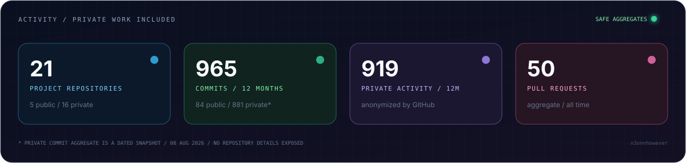
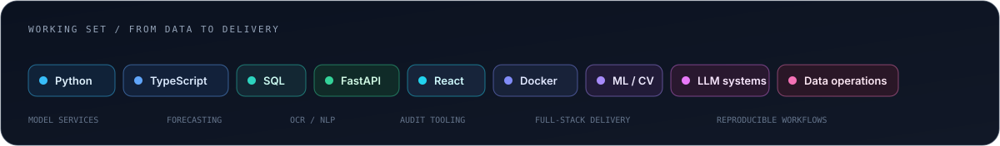

  

  <strong>Building the whole path from raw data to a product people can actually use.</strong> 
  Applied ML, data systems, model services, analytics interfaces, and reliable delivery.

  <a href="https://github.com/n3onnhowever?tab=repositories&type=source">public builds</a>
  &nbsp;&middot;&nbsp;
  <a href="https://github.com/search?q=type%3Apr+author%3An3onnhowever&type=pullrequests">pull requests</a>
  &nbsp;&middot;&nbsp;
  <a href="https://github.com/n3onnhowever/n3onnhowever">profile source</a>

  

## Selected public builds

<table>
  <tr>
    <td width="50%" valign="top">
      <h3><a href="https://github.com/n3onnhowever/unturned-lenta-tech">Unturned</a> PUBLIC</h3>
      <strong>Video to structured retail data.</strong>
      
An end-to-end computer vision pipeline for detecting, classifying, and reading shelf price tags, with job tracking and CSV delivery.

      <code>Python</code> <code>FastAPI</code> <code>React</code> <code>OCR</code> <code>Docker</code>
    </td>
    <td width="50%" valign="top">
      <h3><a href="https://github.com/n3onnhowever/serenity-analytics">Serenity Analytics</a> PUBLIC</h3>
      <strong>Time-series forecasting as a usable product.</strong>
      
A forecasting workspace with ETS models, scenario analysis, quality metrics, manual controls, and spreadsheet export.

      <code>TypeScript</code> <code>React</code> <code>Vite</code> <code>Forecasting</code>
    </td>
  </tr>
  <tr>
    <td width="50%" valign="top">
      <h3><a href="https://github.com/n3onnhowever/hr-agent">HR Agent</a> PUBLIC</h3>
      <strong>Structured AI-assisted interviews.</strong>
      
A service for running interview flows, analyzing candidate responses, producing reports, and integrating through an API.

      <code>Python</code> <code>FastAPI</code> <code>LLM</code> <code>Docker</code>
    </td>
    <td width="50%" valign="top">
      <h3><a href="https://github.com/n3onnhowever/social-insight">Social Insight</a> PUBLIC</h3>
      <strong>Signal extraction from social content.</strong>
      
A social media analysis application with BERT classification, ranking, source filters, category analytics, and visual exploration.

      <code>Python</code> <code>Streamlit</code> <code>BERT</code> <code>Jupyter</code>
    </td>
  </tr>
</table>

## Selected private work

These are intentionally high-level capability summaries. Repository names, clients, datasets, endpoints, model details, performance figures, and internal architecture remain private.

<table>
  <tr>
    <td width="50%" valign="top">
      <h3>Operational Data Inventory PRIVATE</h3>
      <strong>Read-only audit tooling for operational exports.</strong>
      
Inventory, normalization, spreadsheet reporting, and portable handoff flows designed for non-technical operators.

      <code>TypeScript</code> <code>Node.js</code> <code>Excel</code> <code>Automation</code>
    </td>
    <td width="50%" valign="top">
      <h3>Financial Forecasting Platform PRIVATE</h3>
      <strong>Decision support across frontend and backend services.</strong>
      
A full-stack analytics workspace for time-series exploration, forecasting scenarios, and operational decision-making.

      <code>Python</code> <code>TypeScript</code> <code>API</code> <code>Analytics</code>
    </td>
  </tr>
  <tr>
    <td width="50%" valign="top">
      <h3>Visual Computing Studio PRIVATE</h3>
      <strong>Creative tooling for still and animated compositions.</strong>
      
A browser-based workspace for shader-driven visual experiments, editing, motion, and export-oriented workflows.

      <code>TypeScript</code> <code>Svelte</code> <code>Shaders</code> <code>Rendering</code>
    </td>
    <td width="50%" valign="top">
      <h3>Inspection Intelligence PRIVATE</h3>
      <strong>Computer vision with a human review loop.</strong>
      
Applied vision workflows for identifying, organizing, and reviewing visual inspection findings.

      <code>Python</code> <code>C#</code> <code>Computer Vision</code> <code>Review UX</code>
    </td>
  </tr>
  <tr>
    <td width="50%" valign="top">
      <h3>Research Copilot PRIVATE</h3>
      <strong>AI-assisted evidence organization.</strong>
      
A research workflow focused on source discovery, structured analysis, and making evidence easier to inspect.

      <code>TypeScript</code> <code>Python</code> <code>AI</code> <code>Research UX</code>
    </td>
    <td width="50%" valign="top">
      <h3>Interactive Product Systems PRIVATE</h3>
      <strong>Motion-led prototypes and product presentation.</strong>
      
Interactive web experiments combining expressive motion, real-time rendering, and practical product interfaces.

      <code>TypeScript</code> <code>JavaScript</code> <code>SCSS</code> <code>Motion</code>
    </td>
  </tr>
</table>

## Working set

  

## Operating principles

| Observable by default | Reproducible by design | Useful outside a notebook |
| :--- | :--- | :--- |
| Clear state, errors, and audit trails. | Explicit inputs, contracts, and repeatable runs. | Interfaces and handoffs built for real operators. |

  
<strong>How private activity is represented</strong>

   
  GitHub exposes private activity to public viewers only as anonymized contribution counts. The exact private commit aggregate in the activity card is a local, dated snapshot of default-branch commits; no repository names, commit messages, SHA values, organizations, or code are published. The weekly workflow uses the repository-scoped <code>GITHUB_TOKEN</code> and cannot read private repositories.

  Build the model. Build the system around it. Make the result understandable.

