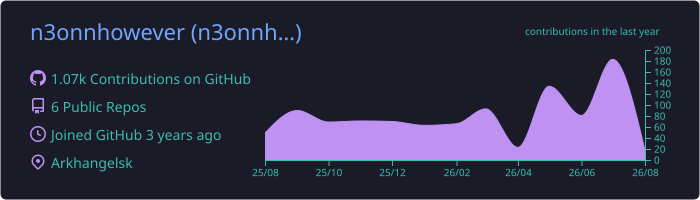
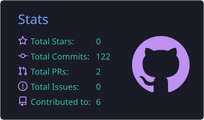
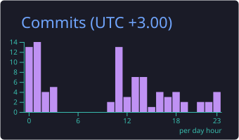

  

  

  <a href="https://github.com/n3onnhowever?tab=repositories&type=source">public builds</a>
  &nbsp;&middot;&nbsp;
  <a href="https://github.com/search?q=type%3Apr+author%3An3onnhowever&type=pullrequests">pull requests</a>
  &nbsp;&middot;&nbsp;
  <a href="https://github.com/n3onnhowever/n3onnhowever">profile source</a>

## About

I build data products that connect machine learning with dependable engineering.
My public work spans computer vision, forecasting, NLP, analytics, and operator-focused automation.

## Working set

  

## GitHub signal

  

  
  

Summary cards are refreshed by GitHub Actions. Private activity is represented only as aggregate contribution, commit, pull request, issue, language, and productive-time statistics.

## Selected public builds

  
  

## Streak

  

## Contribution landscape

  

## ON REPEAT

  

<a href="https://open.spotify.com/track/2lpLHJXgSGFU5GuIk8qzgs">New Trip (feat. Yeat &amp; BNYX(R))</a> - Quavo, Yeat, BNYX(R)

  

